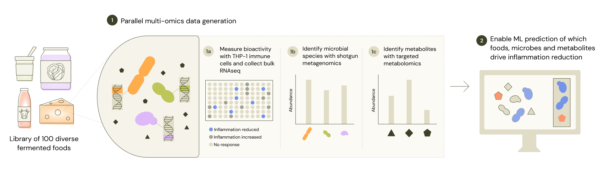

# Supermarket Sweep

This repository contains raw data, results files, figures, and code for the Supermarket Sweep project at Microcosm Foods. This project surveyed over 100 commercially available fermented foods to identify predictive drivers of anti-inflammatory activities in these foods. We profiled food samples using standard cell-based biomarker measurements and multi-omics tools including shotgun metagenomics, untargeted metabolomics,and bulk RNA-seq of the cell-based assays. 

Raw data and results can also be found through our Microcosm Foods [Zenodo community page](https://zenodo.org/communities/microcosmfoods/records).

Read and cite the preprint [here](https://www.biorxiv.org/content/10.64898/2026.09.22.753573v1): **Enabling predictive modeling of molecular connections between fermented foods and human inflammation through a paired dataset of cell-based models and multi-omics approaches.** McDaniel EA, Schertler M., Edillor C., Dutton RJ. *bioRxiv.* 2026. DOI:10.64898/2026.09.22.753573